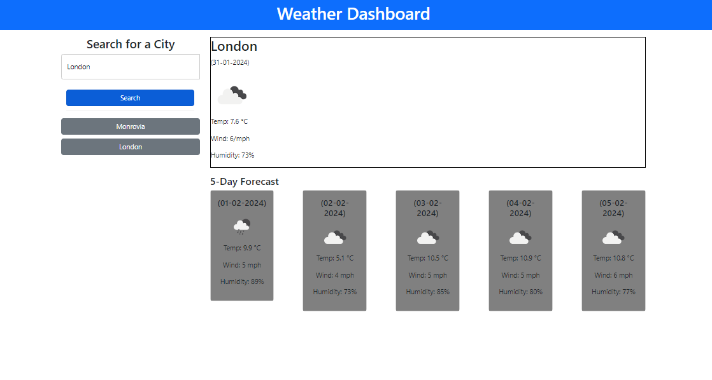

# Weather-Dashboard

This is a weather dashboard project that allows users to search for a city and view the current weather conditions as well as the 5-day forecast for that city. The project also keeps track of the search history, allowing users to easily access previously searched cities.

## Technology Used

The weather dashboard project utilizes the following technologies:

- HTML
- CSS
- JavaScript
- OpenWeatherMap API

## Usage

To use the weather dashboard, follow these steps:

- Open the weather dashboard in a web browser.
- Enter the name of a city in the search input field.
- Click the search button or press Enter.
- The current weather conditions and 5-day forecast for the entered city will be displayed.
- To view the weather conditions for a previously searched city, click on the city in the search history.

## Installation

Clone the repository:

git clone https://github.com/teddwill123/Weather-Dashboard.git

## License

This project is licensed under the MIT License.

